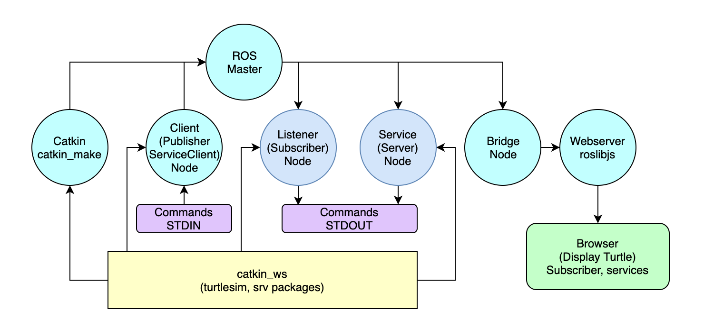
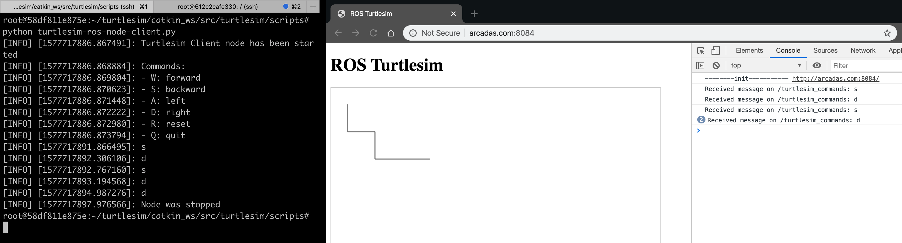

# ROS TurtleSim with Docker and JS

ROS ([Robot Operating System](http://wiki.ros.org/ROS/Introduction)) is an open-source, meta-operating system for robots. It provides the services you would expect from an operating system. It also provides tools and libraries for obtaining, building, writing, and running code across multiple computers.

[Catkin](http://wiki.ros.org/catkin) is a low-level build system macros and infrastructure for ROS. [Catkin Command Line Tools](https://catkin-tools.readthedocs.io).

[Rosbridge](http://wiki.ros.org/rosbridge_suite) provides a JSON interface to ROS, allowing any client to send JSON to publish or subscribe to ROS topics, call ROS services, and more. Rosbridge supports a variety of transport layers, including WebSockets and TCP.

[Roslibjs](http://wiki.ros.org/roslibjs) is the core JavaScript library for interacting with ROS from the browser. It uses WebSockets to connect with rosbridge.

This projects are released as part of the [Robot Web Tools](http://robotwebtools.org/) effort.

[Turtlesim](http://wiki.ros.org/turtlesim) is a tool made for teaching ROS and ROS packages.

[Docker](https://docker-curriculum.com) is a tool that allows developers, sys-admins etc. to easily deploy their applications in a sandbox (called containers) to run on the host operating system i.e. Linux.

You can create ROS programs mainly in two programming languages: [Python and C++](https://www.theconstructsim.com/learn-ros-python-or-cpp/). I will prefer Python in this tutorial, but pull requests are welcome for cpp.

## Turtlesim Docker Architecture



## Environment

OS: Ubuntu 18.04.3 LTS \
ROS: melodic \
Docker version: 19.03

## First steps

Create a project directory:

```sh
cd ~
mkdir turtlesim
```

Create a Docker network:

```sh
docker network create turtlesim
```

Start a ROS master:

```sh
docker container run -dit \
    --net turtlesim \
    --name ros-turtlesim-master \
    ros:melodic-ros-base \
    roscore
```

## Catkin

Create a Catkin workspace on host computer in the project directory:

```sh
mkdir catkin_ws
```

Start a container for Catkin:

```sh
docker run -it \
    --net turtlesim \
    --env ROS_HOSTNAME=ros-turtlesim-catkin \
    --env ROS_MASTER_URI=http://ros-turtlesim-master:11311 \
    -v ~/turtlesim/catkin_ws:/root/turtlesim/catkin_ws \
    --name ros-turtlesim-catkin \
    ros:melodic-ros-core \
    /bin/bash
```

Catkin setup in the container:

```sh
# Environment setup
source /opt/ros/melodic/setup.bash

# Build Catkin
cd /root/turtlesim/catkin_ws
mkdir src
catkin_make

# Devel environment setup
source devel/setup.bash

# Create package with rospy and std_msg
cd src/
catkin_create_pkg turtlesim rospy std_msgs
cd ..

# Rebuild Catkin
catkin_make
```

## Client (Publisher) Node

Create node py file on the host computer in the project directory:

```sh
cd ~/turtlesim/catkin_ws/src
# TODO - set up proper user rights
sudo chmod -R 777 turtlesim
mkdir scripts
cd scripts
vim turtlesim-ros-node-client.py
```

Edit: [turtlesim-ros-node-client.py](catkin_ws/src/turtlesim/scripts/turtlesim-ros-node-client.py)

***Note:** In ROS, nodes are uniquely named. If two nodes with the same name are launched, the previous one is kicked off. The anonymous=True flag means that rospy will choose a unique name for our node so that multiple node can run simultaneously. E.g.: `rospy.init_node('name_of_the_node', anonymous=True)` and the name will be `name_of_the_node_<random_numbers>`.*

Start a container for Client node:

```sh
docker container run -it \
    --net turtlesim \
    --env ROS_HOSTNAME=ros-turtlesim-client \
    --env ROS_MASTER_URI=http://ros-turtlesim-master:11311 \
    -v ~/turtlesim/catkin_ws:/root/turtlesim/catkin_ws \
    --name ros-turtlesim-client \
    ros:melodic-ros-base \
    /bin/bash
```

Start the Client node:

```sh
cd /root/turtlesim/catkin_ws/src/turtlesim/scripts
python turtlesim-ros-node-client.py
```

## Check publisher node in the Catkin container

```sh
# Node list
# /turtlesim_client
rosnode list

# Node info
rosnode info /turtlesim_client

# List active topics
# /turtlesim_commands
rostopic list

# Echo publisher messages
# TODO - Commands from STDIN
rostopic echo /turtlesim_commands
```

## Listener (Subscriber) Node

Create node py file on the host computer in the project directory:

```sh
cd ~/turtlesim/catkin_ws/src/turtlesim/scripts
vim turtlesim-ros-node-listener.py
```

Edit: [turtlesim-ros-node-listener.py](catkin_ws/src/turtlesim/scripts/turtlesim-ros-node-listener.py)

Start a container for Listener node:

```sh
docker container run -it \
    --net turtlesim \
    --env ROS_HOSTNAME=ros-turtlesim-listener \
    --env ROS_MASTER_URI=http://ros-turtlesim-master:11311 \
    -v ~/turtlesim/catkin_ws:/root/turtlesim/catkin_ws \
    --name ros-turtlesim-listener \
    ros:melodic-ros-base \
    /bin/bash
```

Start the Listener node:

```sh
cd /root/turtlesim/catkin_ws/src/turtlesim/scripts
python turtlesim-ros-node-listener.py
```

## Check listener node in the Catkin container

```sh
# List nodes
rosnode list
# List topics
rostopic list
# Show topic info
rostopic info /turtlesim_commands
```

If you want check your subscriber node without a publisher, can publish manually:

```sh
# Olny one message will be published
rostopic pub -1 /turtlesim_commands std_msgs/String "data: 'Command test'"
# Publish messages continuously (5 Hz) - rate mode
rostopic pub -r 5 /turtlesim_commands std_msgs/String "data: 'Command test'"
```

## Bridge Node

Create a ROS Melodic Bridge Docker image:

```sh
# Change directory into the repo
cd /path/to/repo/turtlesim-ros-docker-js/ros-melodic-bridge
# Build image from Dockerfile
docker build -t ros-melodic-bridge .
# List images
docker images
```

Start a container for Bridge node:

```sh
docker container run -it \
    --net turtlesim \
    -p 9094:9090 \
    --env ROS_HOSTNAME=ros-turtlesim-bridge \
    --env ROS_MASTER_URI=http://ros-turtlesim-master:11311 \
    -v ~/turtlesim/catkin_ws:/root/turtlesim/catkin_ws \
    --name ros-turtlesim-bridge \
    ros-melodic-bridge \
    /bin/bash
```

Run rosbridge:

```sh
rosrun rosbridge_server rosbridge_websocket
```

TODO: create a rosbridge image.

## Webserver

Copy the source code of web application into the project direcctory:

```sh
cd ~/turtlesim
cp -a /path/to/repo/turtlesim-ros-docker-js/webserver .
```

Or create symbolic link:

```sh
ln -s /path/to/repo/turtlesim-ros-docker-js/webserver .
```

Start a container for Webserver:

```sh
docker container run -d \
    --net turtlesim \
    -p 8084:80 \
    -v ~/turtlesim/webserver:/usr/share/nginx/html:ro \
    --name turtlesim-nginx \
    nginx
```

Check the webserver: [http://<host_ip>:8084](http://localhost:8084).



## Troubleshooting

List all container IP addresses:

```sh
docker ps -q | xargs -n 1 docker inspect --format '{{range .NetworkSettings.Networks}}{{.IPAddress}}{{end}} {{ .Name }}' | sed 's/ \// /'
```

Install `ping` and `telnet` command inside a container:

```sh
apt-get update
apt-get install -y iputils-ping telnet
```
