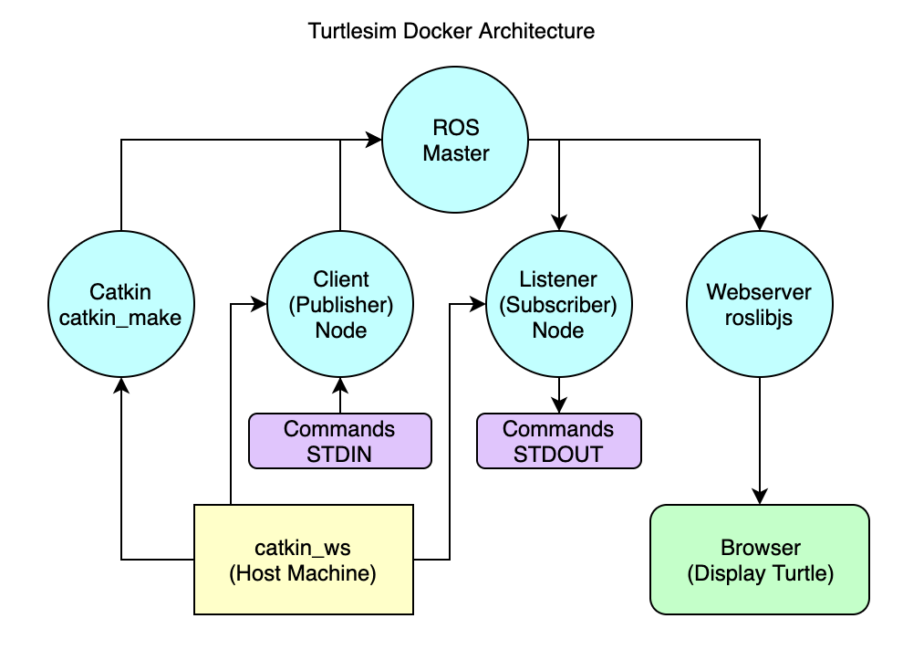

# ROS TurtleSim with Docker and JS



## Documentation

ROS: http://wiki.ros.org/ROS/Introduction \
Docker for Beginners: https://docker-curriculum.com/ \
Catkin: https://catkin-tools.readthedocs.io

## Environment

OS: Ubuntu 18.04.3 LTS \
ROS: melodic \
Docker version: 19.03

## First steps

Create a project directory:

```sh
cd ~
mkdir turtlesim
```

Create a Docker network:

```sh
docker network create turtlesim
```

Start a ROS master:

```sh
docker container run -dit \
    --net turtlesim \
    --name ros-turtlesim-master \
    ros:melodic-ros-base \
    roscore
```

## Catkin

Create a Catkin workspace on host computer in the project directory:

```sh
mkdir catkin_ws
```

Start a container for Catkin:

```sh
docker run -it \
    --net turtlesim \
    --env ROS_HOSTNAME=ros-turtlesim-catkin \
    --env ROS_MASTER_URI=http://ros-turtlesim-master:11311 \
    -v ~/turtlesim/catkin_ws:/root/turtlesim/catkin_ws \
    --name ros-turtlesim-catkin \
    ros:melodic-ros-core \
    /bin/bash
```

Catkin setup in the container:

```sh
# Environment setup
source /opt/ros/melodic/setup.bash
# Build Catkin
cd /root/turtlesim/catkin_ws
mkdir src
catkin_make
# Devel environment setup
source devel/setup.bash
# Create package with rospy and std_msg
cd src/
catkin_create_pkg turtlesim rospy std_msgs
cd ..
# Rebuild Catkin
catkin_make
```

## Client (Publisher) Node

Create node py file on the host computer in the project directory:

```sh
cd ~/turtlesim/catkin_ws/src/turtlesim/
# TODO - set up proper user rights
sudo chmod -R 777 turtlesim
mkdir scripts
cd scripts
touch turtlesim-ros-node-client.py
chmod 777 turtlesim-ros-node-client.py
vim turtlesim-ros-node-client.py
```

Edit file:

```py
#!/usr/bin/python

import rospy
from std_msgs.msg import String

if __name__ == '__main__':
    rospy.init_node('turtlesim_client')
    rospy.loginfo("Turtlesim Client node has been started")
    pub = rospy.Publisher("/turtlesim_commands", String, queue_size=10)
    rate = rospy.Rate(2)
    while not rospy.is_shutdown():
        msg = String()
        msg.data = "TODO - Commands from STDIN"
        pub.publish(msg)
        rate.sleep()
    rospy.loginfo("Node was stopped")
```

Start a container for Client node:

```sh
docker container run -it \
    --net turtlesim \
    --env ROS_HOSTNAME=ros-turtlesim-client \
    --env ROS_MASTER_URI=http://ros-turtlesim-master:11311 \
    -v ~/turtlesim/catkin_ws:/root/turtlesim/catkin_ws \
    --name ros-turtlesim-client \
    ros:melodic-ros-base \
    /bin/bash
```

Start the Client node:

```sh
cd /root/turtlesim/catkin_ws/src/turtlesim/scripts
python turtlesim-ros-node-client.py
```

## Check publisher node in the Catkin container

```sh
# Node list
# /turtlesim_client
rosnode list

# Node info
rosnode info /turtlesim_client

# List active topics
# /turtlesim_commands
rostopic list

# Echo publicher messages
# TODO - Commands from STDIN
rostopic echo /turtlesim_commands
```

## TODO

- stdin for commands
- Listener node (log)
- JS container with roslibjs (draw)
- docker user rights issue

## Troubleshooting

List all container IP addresses:

```sh
docker ps -q | xargs -n 1 docker inspect --format '{{range .NetworkSettings.Networks}}{{.IPAddress}}{{end}} {{ .Name }}' | sed 's/ \// /'
```

Install `ping` and `telnet` command:

```sh
apt-get update
apt-get install -y iputils-ping telnet
```
